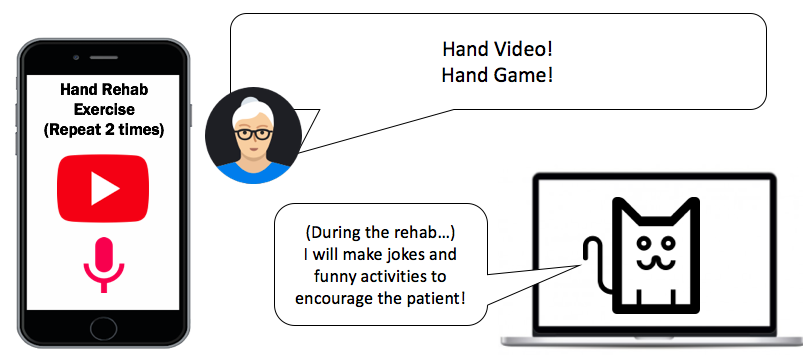
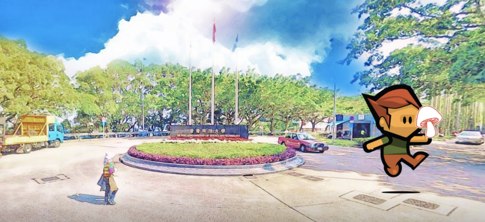

# HabBot 

Gamification of Rehabilitation for Stroke Patients and Family Members

## Idea

## Screenshot

## Key features
- Speech recognition for stroke patients
- Gamification of Hand rehab exercise
- Update the progress report for the family members 
